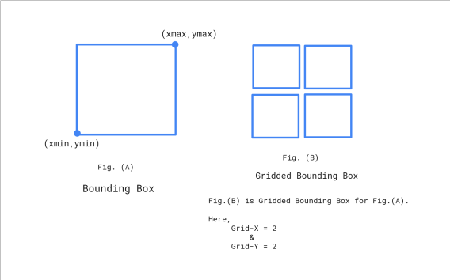

# BoundingBox
This project is a small library for GIS (Geographic Information System) and introduced the **GriddedBoundingBox** `algorithm`.

### Gridded Bounding Box

 

The above image is a simple demonstration of GriddedBoundingBox.
